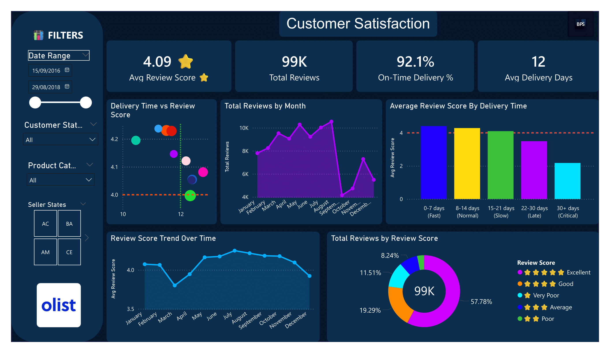

# olist-powerbi-sql-analytics
# Brazilian E-Commerce Analytics (Olist)  
**Power BI | PostgreSQL | SQL Data Modelling**

## Project Overview
This project analyses a real Brazilian e-commerce marketplace dataset provided by Olist.  
The goal was to build an end-to-end analytics solution — from raw transactional data in SQL to an executive-ready Power BI dashboard — mirroring how analytics is delivered in real business environments.

The dashboard focuses on **commercial performance**, **customer satisfaction**, and **logistics efficiency**, with a strong emphasis on clean data modelling and explainable insights.

---

## Business Questions Answered
- How is overall revenue and order volume trending over time?
- Which product categories and regions drive the most revenue?
- How do delivery times impact customer review scores?
- Which states experience the longest delivery delays?
- Where are late deliveries most concentrated geographically?

---

## Tech Stack
- **Database:** PostgreSQL  
- **Querying & Modelling:** SQL (fact & dimension tables)  
- **Visualisation:** Power BI Desktop  
- **Version Control:** GitHub  

---

## Data Source
- Brazilian E-Commerce Public Dataset by Olist (Kaggle)
- Real anonymised marketplace data including orders, customers, sellers, products, payments, reviews, and delivery timestamps.

---

## Data Modelling Approach
A star-schema-style analytical model was built in PostgreSQL:

**Raw Layer**
- Orders, order items, customers, sellers, products, reviews, payments

**Analytics Layer**
- `fact_orders` – order-item grain (revenue, delivery metrics)
- `fact_reviews` – customer review records
- `dim_customers` – customer location and identifiers
- `dim_products` – product categories
- `dim_sellers` – seller locations
- `dim_orders` (bridge) – unique order IDs to resolve many-to-many relationships

This approach mirrors real BI modelling challenges, including resolving duplicate keys across multiple fact tables.

---

## Power BI Dashboard Pages

### 1️⃣ Executive Overview
- Total Revenue, Total Orders, Average Order Value
- Late Delivery %
- Monthly revenue and order trends
- Revenue by product category

---

### 2️⃣ Customer Satisfaction
- Average review score & total reviews
- Review score distribution
- Impact of delivery time on customer satisfaction
- Review trends over time

---

### 3️⃣ Geographic & Logistics Performance
- Revenue by customer and seller state (maps)
- Late delivery % by state
- States with longest average delivery times
- Seller performance table

---

## Key Insights
- Customer satisfaction drops sharply as delivery times exceed 15–20 days.
- Late deliveries are geographically concentrated rather than evenly distributed.
- A small number of product categories contribute a disproportionate share of revenue.
- Operational delays, not order volume, are the main driver of poor reviews.

---

## Skills Demonstrated
- SQL data ingestion and transformation
- Fact & dimension table design
- Handling many-to-many relationships using bridge tables
- Power BI data modelling and DAX
- Executive-level dashboard design
- Translating data into business insight

---

## Next Improvements
- Add profit and margin metrics
- Introduce cohort analysis for repeat customers
- Automate refresh pipeline
- Add seller-level SLA benchmarking

---

## Author
**Ben Shinnick**  
Data Analytics Portfolio Project  
