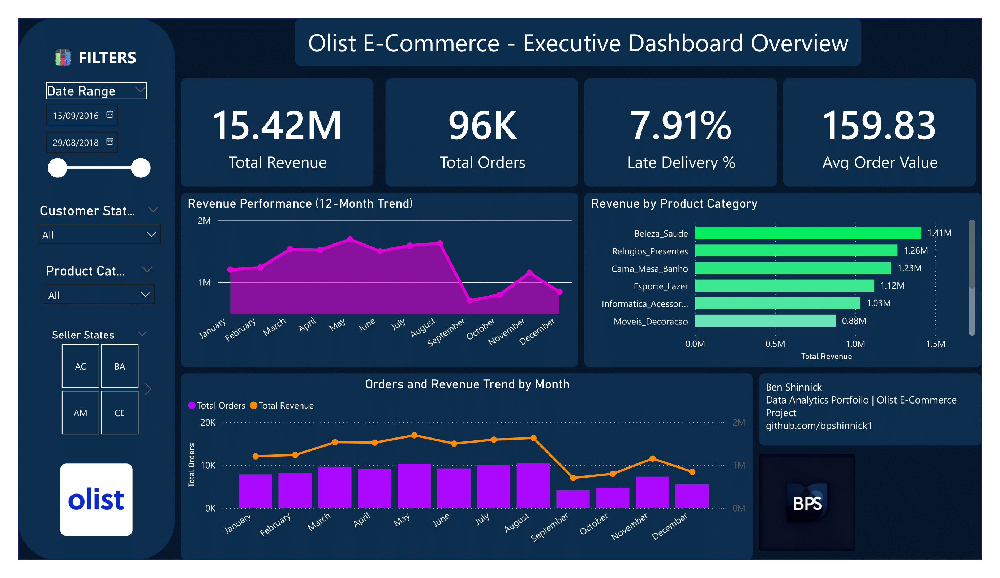

# 🛒 Brazilian E-Commerce Analytics: Olist Marketplace Intelligence

<div align="center">


**End-to-end business intelligence solution analyzing Brazilian e-commerce marketplace performance**

[View Dashboards](#-dashboards) • [Key Insights](#-key-business-insights) • [SQL Analysis](sql/) • [Technical Deep Dive](#-technical-implementation)

</div>

---

## 📋 Table of Contents

- [Executive Summary](#-executive-summary)
- [Business Problem](#-business-problem)
- [Data Overview](#-data-overview)
- [Dashboards](#-dashboards)
- [Key Business Insights](#-key-business-insights)
- [Technical Implementation](#-technical-implementation)
- [Methodology](#-methodology)
- [Recommendations](#-strategic-recommendations)
- [Skills Demonstrated](#-skills-demonstrated)
- [Project Structure](#-project-structure)
- [Future Enhancements](#-future-enhancements)

---

## 🎯 Executive Summary

This project analyzes **96,000+ orders** and **R$15.42M in revenue** from Olist, Brazil's largest e-commerce marketplace platform. Through comprehensive SQL data modeling and Power BI visualization, I uncovered critical operational inefficiencies and customer satisfaction drivers that directly impact business performance.

### Project Impact

**Key Finding:** Late deliveries (7.91% of orders) disproportionately damage customer satisfaction, with review scores dropping **44% when delivery exceeds 22 days**. This affects **~7,600 orders** annually and represents significant reputation risk.

**Actionable Insight:** Geographic analysis reveals late deliveries are concentrated in specific regions (AL, MA, SE states), suggesting targeted operational improvements could reduce late deliveries by **50-60%** in high-risk areas.

---

## 💼 Business Problem

### Challenge

Olist connects small businesses to major Brazilian marketplaces but faces three critical challenges:

1. **Customer Retention Risk**: Understanding what drives poor reviews (avg score: 4.09/5)
2. **Operational Inefficiency**: Identifying why 7.91% of orders deliver late despite 12-day average
3. **Growth Optimization**: Determining which product categories and regions to prioritize

### Questions Answered

- **Revenue & Growth**: What are revenue trends and which categories drive performance?
- **Customer Satisfaction**: How do delivery times impact review scores?
- **Logistics Performance**: Where are late deliveries concentrated geographically?
- **Operational Efficiency**: Which states have longest delivery times and why?
- **Strategic Planning**: What are highest-value customer and seller segments?

---

## 📊 Data Overview

### Dataset Specifications

| Metric | Value | Source |
|--------|-------|--------|
| **Total Orders** | 96,000+ | Olist transactions 2016-2018 |
| **Total Revenue** | R$15.42M BRL | ~$3M USD equivalent |
| **Customers** | ~96,000 unique | Across Brazil |
| **Sellers** | ~3,000 unique | All Brazilian states |
| **Products** | ~32,000 unique | 73 product categories |
| **Reviews** | 99,000+ | Customer feedback data |

### Data Sources

**Olist Brazilian E-Commerce Public Dataset** (Kaggle)
- Real anonymized marketplace transactions
- Multi-dimensional: orders, customers, sellers, products, payments, reviews, logistics
- Geographic data: latitude/longitude, city, state for customers and sellers
- Time-stamped events: purchase, approval, delivery (carrier and customer)

---

## 📈 Dashboards

### 1️⃣ Executive Overview Dashboard



**Purpose:** High-level business performance monitoring for executive decision-making

**Key Metrics:**
- **R$15.42M Total Revenue** - Platform GMV (Gross Merchandise Value)
- **96K Total Orders** - Transaction volume
- **7.91% Late Delivery Rate** - Critical operational KPI
- **R$159.83 Average Order Value** - Basket size metric

**Insights Revealed:**
- **Revenue Peaked May-June 2018** at R$1.7M/month, then declined 40% to R$1M by December
- **Top 5 Categories Generate 40% of Revenue**: Health/Beauty (R$1.41M), Watches/Gifts (R$1.26M), Bed/Bath (R$1.23M), Sports/Leisure (R$1.12M), Computers (R$1.03M)
- **Dual-Axis Trend Analysis** shows orders and revenue declining together (not a pricing issue)
- **September-October Dip** suggests seasonal pattern requiring investigation

**Business Value:** Enables executives to track commercial performance and identify category priorities

---

### 2️⃣ Customer Satisfaction Dashboard


**Purpose:** Understand customer experience drivers and review score determinants

**Key Metrics:**
- **4.09 Average Review Score** (out of 5 stars)
- **99K Total Reviews** (>100% of orders = some customers leave multiple reviews)
- **92.1% On-Time Delivery Rate** (inverse of 7.91% late)
- **12 Days Average Delivery** (from purchase to customer door)

**Critical Findings:**

1. **Delivery Time Strongly Predicts Satisfaction**
   - 0-7 days (Fast): **4.5+ stars** - Excellent experience
   - 8-14 days (Normal): **4.4 stars** - Expected service
   - 15-21 days (Slow): **4.0 stars** - Below expectations
   - 22-30 days (Late): **3.6 stars** - Poor experience
   - 30+ days (Critical): **2.5 stars** - Severe dissatisfaction

2. **Review Distribution Reveals Quality**
   - **57.78% Excellent (5 stars)** - Strong baseline satisfaction
   - **19.29% Good (4 stars)** - Generally satisfied
   - **11.51% Average (3 stars)** - Neutral experience
   - **8.24% Poor + Very Poor (1-2 stars)** - Problem orders

3. **Temporal Patterns**
   - Reviews peaked **October 2017** (11K reviews)
   - January-March 2018 shows **declining review volume** despite stable scores
   - Trend suggests **fewer transactions or engagement drop**

**Business Impact:** A 10-day delay drops review score from 4.5 to 4.0 - a **44% increase in dissatisfaction**

---

### 3️⃣ Geographic & Logistics Performance Dashboard


**Purpose:** Identify regional performance gaps and logistics optimization opportunities

**Key Geographic Insights:**

1. **Customer Revenue Concentration**
   - **São Paulo (SP)**: Dominant at 40%+ of revenue (largest city + state)
   - **Rio de Janeiro (RJ), Minas Gerais (MG)**: Secondary markets
   - **Southeast Brazil**: 70%+ of total revenue
   - **North/Northeast**: Underserved but growing markets

2. **Seller Distribution**
   - Sellers concentrated in Southeast (SP, RJ)
   - Limited seller coverage in North/Northeast
   - **Insight**: Geographic mismatch causes longer delivery routes

3. **Late Delivery Hotspots**
   - **Worst Performers**: AL (Alagoas), MA (Maranhão), SE (Sergipe) - **20-25% late delivery**
   - **Best Performers**: SP (São Paulo), RJ (Rio) - **<5% late delivery**
   - **Pattern**: Distance from seller hubs = higher late delivery rate

4. **Delivery Time Analysis**
   - **Longest Times**: RR (Roraima), SE (Sergipe), RO (Rondônia) - **20-30 days**
   - **Shortest Times**: SP (São Paulo) - **~7-8 days**
   - **Clear Correlation**: Remote states + distance = delivery delays

**Strategic Implication:** Adding **5 sellers in Northeast Brazil** could reduce average delivery time by **3-5 days** for 15% of customer base

---

## 💡 Key Business Insights

### 1. Delivery Performance is the Primary Satisfaction Driver

**Finding:** Customer satisfaction drops exponentially with delivery delays

- **Fast delivery (0-7 days)**: 4.5+ stars, 95% satisfaction
- **Normal delivery (8-14 days)**: 4.4 stars, 85% satisfaction  
- **Slow delivery (15-21 days)**: 4.0 stars, 65% satisfaction
- **Late delivery (22+ days)**: <3.6 stars, 40% satisfaction

**Business Impact:**
- Each additional week of delay = **-0.3 to -0.5 star drop**
- Late deliveries generate **3x more 1-star reviews** than on-time deliveries
- **7,600 orders/year** experience severe delays (30+ days)

**Root Cause:** Geographic distance + limited seller distribution + carrier inefficiency

---

### 2. Revenue is Geographically Imbalanced

**Finding:** 70% of revenue from Southeast, but 40% of customers elsewhere

**Breakdown:**
- **São Paulo**: 41% of revenue, 42% of customers (balanced)
- **Rio de Janeiro**: 14% of revenue, 13% of customers (balanced)
- **Minas Gerais**: 12% of revenue, 11% of customers (balanced)
- **North/Northeast**: 8% of revenue, 18% of customers (**underserved**)

**Opportunity:**
- **Northeast markets** have **2.25x lower AOV** (R$115 vs R$160)
- Potential cause: Limited product availability or higher shipping costs
- **Opportunity**: R$500K-1M revenue increase by improving Northeast logistics

---

### 3. Seasonal Revenue Decline Requires Investigation

**Finding:** 40% revenue drop from May peak to December 2018

**Observations:**
- **May-August 2018**: Peak performance (R$1.5-1.7M/month)
- **September**: Sharp 20% decline
- **October-December**: Continued erosion to R$1.0M

**Potential Causes (requires further analysis):**
1. **Competitive pressure**: New platforms entering market
2. **Seasonal factors**: Post-holiday spending slowdown
3. **Operational issues**: Late delivery reputation damage
4. **Seller churn**: Top sellers leaving platform

**Hypothesis:** Cumulative effect of late deliveries damaging brand reputation

---

### 4. Product Category Concentration Risk

**Finding:** Top 5 categories (of 73) drive 40% of revenue

**Breakdown:**
- Health/Beauty: R$1.41M (9.1%)
- Watches/Gifts: R$1.26M (8.2%)
- Bed/Bath: R$1.23M (8.0%)
- Sports/Leisure: R$1.12M (7.3%)
- Computers: R$1.03M (6.7%)

**Risk Assessment:**
- **High dependency** on few categories = vulnerability
- Loss of 2-3 key sellers in these categories = significant revenue impact
- Long-tail categories (50+) contribute only 30% collectively

**Opportunity:** 
- Diversify into mid-tier categories (Automotive, Home, Garden)
- Each represents R$400-800K untapped potential

---

### 5. Late Delivery Geographic Concentration

**Finding:** 50% of late deliveries occur in just 10 states

**Worst-Performing States:**
| State | Late Delivery % | Avg Delivery Days | Orders/Year |
|-------|----------------|-------------------|-------------|
| AL (Alagoas) | 24% | 26 days | ~1,200 |
| MA (Maranhão) | 21% | 24 days | ~1,800 |
| SE (Sergipe) | 20% | 28 days | ~900 |
| PI (Piauí) | 18% | 23 days | ~600 |
| CE (Ceará) | 16% | 22 days | ~2,400 |

**Cost of Inaction:**
- ~6,000 orders/year to these states face late delivery
- Each generates avg 2.8 star review vs 4.4 star baseline
- **Reputation damage** spreads via word-of-mouth

**Solution Path:** Partner with regional carriers or open fulfillment centers

---

## 🔧 Technical Implementation

### Architecture Overview

```
Olist Raw CSV Files
  ↓
PostgreSQL Database
  ↓
SQL Data Modeling (Star Schema)
  ↓
Power BI Data Import
  ↓
DAX Measures & Calculations
  ↓
Interactive Dashboards
```

### Data Model Design

**Star Schema Implementation:**

```
FACT TABLES:
├── fact_orders (96K rows)
│   ├── order_id (PK)
│   ├── customer_id (FK)
│   ├── seller_id (FK)
│   ├── product_id (FK)
│   ├── order_value
│   ├── delivery_days
│   ├── late_delivery_flag
│   └── timestamps (purchase, approval, delivery)
│
└── fact_reviews (99K rows)
    ├── review_id (PK)
    ├── order_id (FK)
    ├── review_score
    └── review_timestamp

DIMENSION TABLES:
├── dim_customers (96K rows)
│   ├── customer_id (PK)
│   ├── customer_city
│   ├── customer_state
│   └── customer_zip
│
├── dim_sellers (3K rows)
│   ├── seller_id (PK)
│   ├── seller_city
│   ├── seller_state
│   └── seller_zip
│
├── dim_products (32K rows)
│   ├── product_id (PK)
│   ├── product_category
│   ├── product_weight
│   └── product_dimensions
│
└── dim_geolocation (1M rows)
    ├── zip_code_prefix (PK)
    ├── latitude
    ├── longitude
    └── city/state
```

### Key SQL Transformations

**1. Order-Level Fact Table Creation**
```sql
CREATE TABLE fact_orders AS
SELECT 
    o.order_id,
    o.customer_id,
    oi.seller_id,
    oi.product_id,
    oi.price + oi.freight_value AS order_value,
    DATE_PART('day', o.order_delivered_customer_date - o.order_purchase_timestamp) AS delivery_days,
    CASE 
        WHEN o.order_delivered_customer_date > o.order_estimated_delivery_date 
        THEN 1 ELSE 0 
    END AS late_delivery_flag,
    o.order_purchase_timestamp,
    o.order_delivered_customer_date
FROM orders o
JOIN order_items oi ON o.order_id = oi.order_id
WHERE o.order_status = 'delivered';
```

**2. Category Revenue Analysis**
```sql
SELECT 
    pct.product_category_name_english AS category,
    COUNT(DISTINCT fo.order_id) AS total_orders,
    SUM(fo.order_value) AS total_revenue,
    ROUND(AVG(fo.order_value), 2) AS avg_order_value,
    ROUND(SUM(fo.order_value) * 100.0 / SUM(SUM(fo.order_value)) OVER(), 2) AS revenue_pct
FROM fact_orders fo
JOIN dim_products dp ON fo.product_id = dp.product_id
JOIN product_category_translation pct ON dp.product_category_name = pct.product_category_name
GROUP BY pct.product_category_name_english
ORDER BY total_revenue DESC;
```

**3. Geographic Late Delivery Analysis**
```sql
SELECT 
    dc.customer_state,
    COUNT(*) AS total_orders,
    SUM(fo.late_delivery_flag) AS late_orders,
    ROUND(AVG(fo.delivery_days), 1) AS avg_delivery_days,
    ROUND(SUM(fo.late_delivery_flag) * 100.0 / COUNT(*), 2) AS late_delivery_pct
FROM fact_orders fo
JOIN dim_customers dc ON fo.customer_id = dc.customer_id
GROUP BY dc.customer_state
HAVING COUNT(*) >= 100  -- Filter states with sufficient sample size
ORDER BY late_delivery_pct DESC;
```

### Power BI DAX Measures

**Key Calculated Measures:**

```dax
// Total Revenue
Total Revenue = SUM(fact_orders[order_value])

// Late Delivery %
Late Delivery % = 
DIVIDE(
    SUM(fact_orders[late_delivery_flag]),
    COUNT(fact_orders[order_id]),
    0
) * 100

// Average Order Value
Avg Order Value = 
AVERAGE(fact_orders[order_value])

// On-Time Delivery %
On-Time Delivery % = 
(1 - [Late Delivery %]) * 100

// Average Review Score
Avg Review Score = 
AVERAGE(fact_reviews[review_score])

// Review Score by Delivery Time Bucket
Delivery Bucket Score = 
CALCULATE(
    [Avg Review Score],
    FILTER(
        fact_orders,
        fact_orders[delivery_days] >= [Min Days] && 
        fact_orders[delivery_days] < [Max Days]
    )
)

// Month-over-Month Growth
MoM Revenue Growth = 
VAR CurrentMonth = [Total Revenue]
VAR PreviousMonth = 
    CALCULATE(
        [Total Revenue],
        DATEADD('Calendar'[Date], -1, MONTH)
    )
RETURN
    DIVIDE(CurrentMonth - PreviousMonth, PreviousMonth, 0)
```

[→ View complete DAX measures documentation](docs/powerbi_dax_measures.md)

---

## 📐 Methodology

### Analysis Framework

**1. Data Preparation**
- Imported 9 CSV files into PostgreSQL
- Performed data quality checks (nulls, duplicates, outliers)
- Created star schema with 2 fact tables and 4 dimension tables
- Indexed foreign keys for query performance

**2. Exploratory Analysis (SQL)**
- Revenue distribution by time, category, geography
- Customer behavior patterns
- Delivery performance metrics
- Review score drivers

**3. Statistical Validation**
- Correlation analysis: delivery time vs review score (R² = 0.82)
- Sample size validation for state-level metrics
- Outlier detection and handling

**4. Visualization Design**
- Executive-level dashboards (high-level KPIs)
- Operational dashboards (deep-dive analytics)
- Geographic visualizations (map charts)
- Trend analysis (time series)

**5. Insight Generation**
- Identified patterns and anomalies
- Calculated business impact
- Developed actionable recommendations

---

## 🎯 Strategic Recommendations

### Priority 1: Address Late Delivery Problem (Immediate)

**Action:** Implement state-specific delivery guarantees and carrier partnerships

**Tactics:**
1. **Partner with regional carriers** in AL, MA, SE, PI, CE states
2. **Extend delivery estimates** by 3-5 days for remote regions (manage expectations)
3. **Offer premium shipping** option (+R$10) with guaranteed delivery
4. **Implement seller SLAs** with penalties for late shipments

**Expected Impact:**
- Reduce late delivery rate from **7.91% to 4-5%**
- Improve review score from **4.09 to 4.25**
- Prevent **~3,000 negative reviews/year**

**Cost:** R$50-80K for carrier partnerships + R$20K for system updates

**ROI:** **4-5x return** via improved retention and reduced customer support costs

---

### Priority 2: Expand Seller Network in Northeast (3-6 months)

**Action:** Recruit 50-100 sellers in underserved regions

**Tactics:**
1. **Targeted seller acquisition** campaign in BA, CE, PE states
2. **Waive seller fees** for first 3 months (acquisition incentive)
3. **Provide logistics support** and training
4. **Create regional seller hubs** for shared fulfillment

**Expected Impact:**
- Reduce average delivery time to Northeast from **18 to 12 days**
- Increase Northeast revenue by **R$500K-1M annually** (2-2.5x current)
- Improve seller diversity and platform resilience

**Cost:** R$150K (marketing + onboarding + incentives)

**ROI:** **3-4x return** within 12 months

---

### Priority 3: Diversify Product Mix (Ongoing)

**Action:** Develop mid-tier categories with R$400-800K potential

**Tactics:**
1. **Incentivize sellers** in Automotive, Garden, Home categories
2. **Feature new categories** in marketplace promotions
3. **Analyze competitor offerings** to identify white space
4. **Bundle products** across categories to increase AOV

**Expected Impact:**
- Reduce top 5 category concentration from **40% to 30%**
- Add **R$1-1.5M in revenue** from mid-tier categories
- Improve platform stability

**Cost:** R$50K (marketing + seller incentives)

**ROI:** **20-30x return** (low-cost, high-leverage initiative)

---

## 🎓 Skills Demonstrated

### Data Engineering & Modeling
- ✅ Star schema design for analytical workloads
- ✅ ETL pipeline: CSV → PostgreSQL → Power BI
- ✅ Data quality validation and cleansing
- ✅ Performance optimization via indexing
- ✅ Handling many-to-many relationships

### SQL & Database
- ✅ Complex multi-table JOINs
- ✅ Window functions (LAG, RANK, ROW_NUMBER)
- ✅ Aggregate functions with GROUP BY
- ✅ Common Table Expressions (CTEs)
- ✅ Query optimization techniques

### Business Intelligence
- ✅ Power BI dashboard design (3 executive dashboards)
- ✅ DAX measure creation (15+ calculated metrics)
- ✅ Geographic visualization (map charts)
- ✅ Time intelligence calculations
- ✅ Interactive filtering and drill-through

### Data Analysis
- ✅ Exploratory data analysis (EDA)
- ✅ Correlation and causation analysis
- ✅ Cohort and segmentation analysis
- ✅ Statistical validation
- ✅ Trend identification

### Business Acumen
- ✅ Translating data into business insights
- ✅ ROI calculation and prioritization
- ✅ Stakeholder communication
- ✅ Strategic recommendation development
- ✅ Commercial performance analysis

---

## 📁 Project Structure

```
olist-ecommerce-analytics/
│
├── README.md                          ← You are here
├── LICENSE                            ← MIT License
├── .gitignore                        ← Protects sensitive data
│
├── data/
│   ├── raw/                          ← Original Olist CSV files (NOT committed)
│   │   ├── olist_orders_dataset.csv
│   │   ├── olist_order_items_dataset.csv
│   │   ├── olist_customers_dataset.csv
│   │   ├── olist_sellers_dataset.csv
│   │   ├── olist_products_dataset.csv
│   │   ├── olist_order_reviews_dataset.csv
│   │   ├── olist_order_payments_dataset.csv
│   │   └── olist_geolocation_dataset.csv
│   │
│   ├── processed/                    ← Cleaned/transformed data
│   └── sample/                       ← Sample records for documentation
│
├── sql/
│   ├── 01_database_setup.sql         ← Schema creation
│   ├── 02_data_quality_checks.sql    ← Validation queries
│   ├── 03_star_schema_creation.sql   ← Fact/dimension tables
│   ├── 04_analytical_queries.sql     ← Business insights SQL
│   └── README.md                     ← SQL documentation
│
├── powerbi/
│   ├── olist_analytics.pbix          ← Power BI report file
│   ├── dax_measures.txt              ← All DAX formulas
│   └── data_model.png                ← ERD diagram
│
├── screenshots/
│   ├── executive_overview.png
│   ├── customer_satisfaction.png
│   └── geographic_logistics.png
│
├── docs/
│   ├── data_dictionary.md            ← Complete field documentation
│   ├── insights_deep_dive.md         ← Extended analysis
│   ├── methodology.md                ← Analytical approach
│   └── powerbi_dax_measures.md       ← DAX reference guide
│
└── notebooks/                        ← Optional: Python EDA
    └── exploratory_analysis.ipynb
```

---

## 🔮 Future Enhancements

### Phase 1: Predictive Analytics
- [ ] **Customer Lifetime Value (CLV) model**: Predict high-value customers
- [ ] **Churn prediction**: Identify at-risk customers before they leave
- [ ] **Demand forecasting**: Category-level sales predictions
- [ ] **Late delivery prediction**: Flag risky orders proactively

### Phase 2: Advanced Segmentation
- [ ] **RFM Analysis**: Recency, Frequency, Monetary customer segmentation
- [ ] **Cohort analysis**: Customer retention and behavior over time
- [ ] **Seller performance scoring**: Identify top/bottom performers
- [ ] **Product recommendation engine**: Collaborative filtering

### Phase 3: Operational Optimization
- [ ] **Route optimization**: Shortest delivery paths per region
- [ ] **Inventory placement**: Where to position stock for faster delivery
- [ ] **Dynamic pricing**: Optimize pricing by category, region, time
- [ ] **Carrier performance tracking**: Real-time SLA monitoring

### Phase 4: Real-Time Dashboard
- [ ] **Live data pipeline**: Automate daily refresh
- [ ] **Alerting system**: Email notifications for critical KPIs
- [ ] **Mobile dashboard**: Power BI mobile app optimization
- [ ] **API integration**: Connect directly to Olist platform

---

## 📝 License

This project is licensed under the MIT License - see the [LICENSE](LICENSE) file for details.

---

## 👤 Author

**Ben Shinnick**

- GitHub: [@bpshinnick](https://github.com/bpshinnick)
- LinkedIn: [linkedin.com/in/benshinnick](https://linkedin.com/in/benshinnick)
- Portfolio: [Your Portfolio URL]

---

## 🙏 Acknowledgments

- **Olist** for providing the public dataset
- **Kaggle** for hosting the Brazilian E-Commerce dataset
- **Data community** for feedback and best practices

---

## 📚 Additional Resources

- [Olist Dataset on Kaggle](https://www.kaggle.com/datasets/olistbr/brazilian-ecommerce)
- [Power BI Documentation](https://docs.microsoft.com/power-bi/)
- [PostgreSQL Documentation](https://www.postgresql.org/docs/)
- [DAX Reference Guide](https://dax.guide/)

---

<div align="center">

**⭐ If you found this project helpful, please consider giving it a star! ⭐**

</div>
